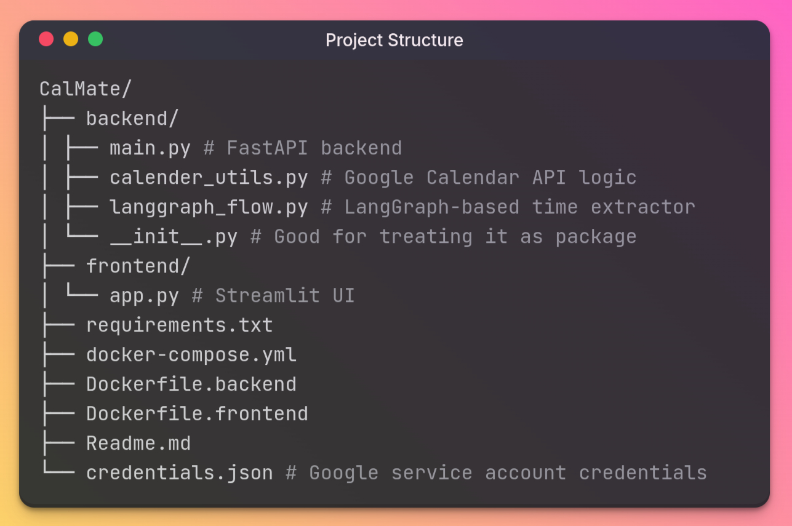

# 🤖 CalMate – Smart Google Calendar Booking Assistant

CalMate is a natural language-powered assistant that helps users **book meetings in their Google Calendar** using plain English like:

> "Schedule a call tomorrow at 3 PM"  
> "Book a meeting next Friday at 10 AM"  
> "Set a discussion for July 15 at 5 PM"

It supports **two modes**:

- ⚡ LLM Mode: Uses GPT-3.5 via OpenRouter API for tool-calling and reasoning
- 🧠 LangGraph Mode: Extracts time using `dateparser` without LLMs (lightweight)

---

## 📦 Features

- ⏰ Smart date/time parsing (`dateparser` + LangGraph or GPT)
- 📆 Google Calendar integration with availability checking
- 🔐 Secure booking using Google Service Account
- 🖼️ Beautiful conversational UI built with **Streamlit**
- 🤖 Tool-calling powered by **OpenRouter GPT API** (LLM mode)
- 🐳 Dockerized deployment for both backend & frontend

---

## 🗂️ Project Structure



---

## 🧠 Modes Explained

- **LLM Mode** Uses **GPT-3.5 via OpenRouter** for intelligent parsing and tool-calling
- **Manual Mode** Uses **LangGraph + dateparser** to extract datetime without using any LLMs

To switch between them:

- Use main_llm.py for full LLM integration
- Use main_manual.py for lightweight mode

---

## 🛠️ Tech Stack

🐍 Python 3.11

⚡ FastAPI

🤖 OpenRouter + GPT-3.5 (LLM mode)

🧠 LangGraph + DateParser (manual mode)

📅 Google Calendar API

🌐 Streamlit

🐳 Docker

---

## Hosted Links

> Frontend: https://calmate-frontend-qn3r.onrender.com
> Backend: https://calmate-backend.onrender.com

---

## 🚀 How to Run Locally with Docker

> ⚠️ Ensure Docker Desktop or Docker Engine is installed.

### 1. Clone the repo

```bash
git clone https://github.com/alucard017/CalMate.git
cd CalMate
```

### 2. Add your credentials.json file

- Go to `Google Cloud Console` and create a `Service Account`.
- Enable `Google Calendar API`.
- Generate and download `credentials.json`.
- Place it at the `project root` (outside the backend/ folder).

### 3. Start the project

```bash
docker-compose up --build
```

- `FastAPI backend` runs at: http://localhost:8000/docs

- `Streamlit frontend` runs at: http://localhost:8501

---

## 🧪 Example Booking Flow

- Open localhost:8501
- Type commands like : "Book a meeting tomorrow at 11 AM"
- Get confirmation with a clickable Google Calendar event link

## 🧑‍💻 Developed By

Made with ❤️ by **Apurba**  
👉 [GitHub](https://github.com/alucard017)
